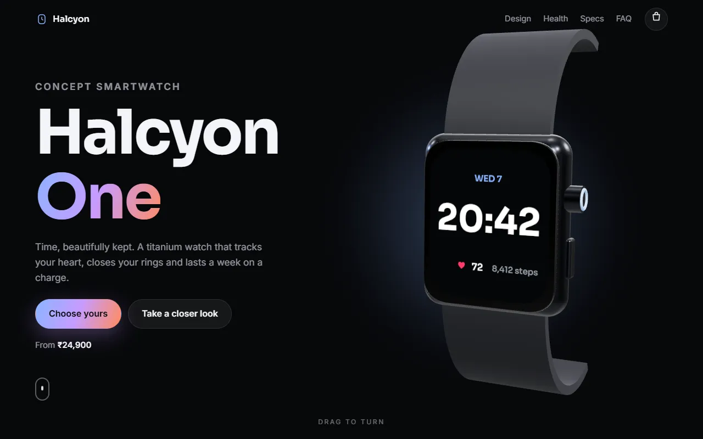

# Halcyon One

A launch page for a concept smartwatch, built around a real 3D model that turns as you scroll. The watch is made entirely in code with [Three.js](https://threejs.org/): no model files, no images.

**Live:** https://jeevan2410.github.io/Landing-Page/



## What it does

- **Scroll story.** The watch stays pinned while five chapters scroll past. It swings from side to side opposite the text, turns to show the crown and button, and its screen changes with each chapter: the time with a beating heart, activity rings that fill up, a battery gauge, and a face in the chosen colour.
- **The model.** A rounded titanium case, a glass front, crown and button, a sensor on the back, and two straps bent into shape by moving the vertices of a box along an arc. The screen is a canvas drawn every frame and used as a texture. Lit by a studio environment so the metal reflects.
- **Finishes.** Four colours that blend the case and strap smoothly, along with the glow behind the watch and the accent colour across the page.
- **Buy section.** Pick a finish and size; the price counts to its new value. "Add to bag" sends a dot arcing into the bag icon. The bag is a drawer with quantities and a total, saved in the browser.
- **And:** count-up stats, a self-drawing heart-rate line, specs, and FAQ answers that slide open.

Drag the watch to spin it. If WebGL or the CDN isn't available, a flat SVG watch takes its place and the rest of the page works. `prefers-reduced-motion` stops the movement; the colour picker and size options work with arrow keys.

**This is a concept made for a portfolio. Nothing is for sale; the bag works but checkout is switched off and no payment details are ever asked for.**

## How it works

Plain HTML, CSS and ES modules, with no build step. Three.js comes from jsDelivr through an import map. Hosted on GitHub Pages.

| File | Job |
|---|---|
| `src/watch.js` | The Three.js scene: geometry, materials, the live screen, drag and render loop |
| `src/store.js` | Pure logic: product, prices, the bag, scroll progress and eased keyframes |
| `src/main.js` | Scroll story, finishes and sizes, bag drawer, reveals and counters |

## Run it

Serve the folder with any static server, for example:

```bash
npx serve .
```

Tests use Node's built-in runner (Node 20+):

```bash
npm test
```
